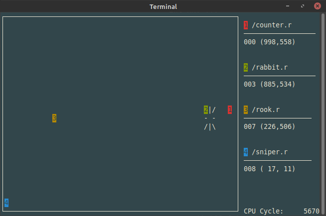

The Original C Robots Programming Game
======================================

CROBOTS ("see-robots") is a game based on computer programming.

Unlike arcade type games which require human inputs controlling some
object, all strategy in CROBOTS must be complete before the actual game
begins.  Game strategy is condensed into a C language program that you
design and write.  Your program controls a robot whose mission is to
seek out, track, and destroy other robots, each running different
programs.  Each robot is equally equipped, and up to four robots may
compete at once.  CROBOTS is best played among several people, each
refining their own robot program, then matching program against program.

CROBOTS consists of a C compiler, a virtual computer, and battlefield
display (text graphics only, monochrome or color).  The CROBOTS compiler
accepts a limited (but useful) subset of the C language.  The C robot
programs are aided by hardware functions to scan for opponents, start
and stop drive mechanisms, fire cannons, etc.  After the programs are
compiled and loaded into separate robots, the battle is observed.
Robots moving, missiles flying and exploding, and certain status
information are displayed on the screen, in real-time.

CROBOTS started out as DOS shareware, but is, as of Oct 23 2013, free
software under terms of the GNU General Public License, version 2.

CROBOTS has been tested and runs on Linux (GLIBC & musl libc), FreeBSD,
macOS, and OmniOS (Illumos/OpenSolaris).

Intended audience
-----------------

CROBOTS will most likely appeal to programmers (especially those who
think they can write the "best" programs), computer game enthusiasts,
people wishing to learn the C language, and those who are interested in
compiler design and virtual computer interpreters.

User interface
--------------

CROBOTS does not use menus, windows, pop-ups, or any other user-friendly
interface.  Since the emphasis is on designing and writing robot control
programs, CROBOTS is started as a compiler might be started, from the
command line.

Origin & References
-------------------

This is the original CROBOTS game, written by Tom Poindexter in 1985.
Ported to Linux by Pablo Algar in 2018.  Please don't bother Tom with
email or patches, he will probably **not** be updating CROBOTS any more.

If you like, you can instead send patches or GitHub pull requests to
this project.  It is the logical continuation of the project and has the
explicit goal of gathering (sane) patches from all forks out there.
